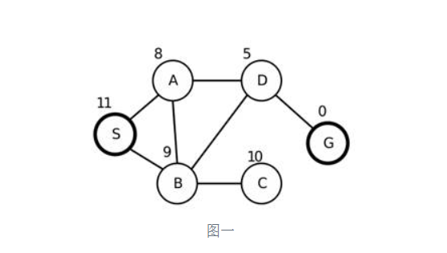
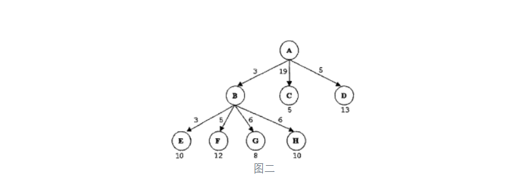

[TOC]

# 人工智能导论 第一次作业

201708010407 - 吴嘉豪


## 题1

### 问

> 考虑一个实时的在线电话翻译系统，该系统实现英语与日语之间的实时在线翻译，讨论该系统的性能度量，环境，执行器，感知器，并对该环境的属性进行分析。

### 答

**性能度量**: 

1. 翻译的准确性(正确翻译内容)
2. 翻译的实时性(翻译速度)
3. 翻译的实用性(翻译出的语音则语音清晰, 翻译出文字则文字可读性高)

**环境**:

1. 电话系统
2. 对话双方

**执行器**:

1. 显示器(以文字形式显示翻译好的内容)
2. 音响/耳机(将翻译的内容播放)

**感知器**:

1. 麦克风(获取输入的声音)

**环境性质分析**:

1. 完全可观察
2. 多agent
3. 确定的
4. 延续式的
5. 连续的
6. 动态的


## 题2

### 问

> 考虑一个医疗诊断系统的agent，讨论该agent最合适的种类(简单agent,基于模型的agent,基于目标的agent和基于效用的agent)并解释你的结论。

### 答

**我认为该agent最适合基于效用的agent.** 

因为对于一个医疗诊断系统, 它是**部分可观察的**(无法观察到病人的一切特征), 同时是**不确定的**, 因为即使是非常相似的图片特征, 他背后可能的病因也是有不同的情况. 

对这个agent的评价, **不能只关注目标**, 因为即使诊断出最好的结果, 但若时间过长或者是技术上难以实施, 也是不可取的.


## 题3

### 问

> 先建立一个完整的搜索树，起点是S,终点是G,如下图,节点旁的数字表示到达目标状态的距离，然后用以下方法表示如何进行搜索，并分析几种算法的完备性、最优性、以及时间复杂度和空间复杂度。
>
> (a).深度优先；
>
> (b).广度优先；
>
> (c).爬山法；
>
> (d).最佳优先；



### 答

**a) 深度优先**: **总是扩展搜索树当前边缘结点集中最深的结点**. 以结点字母顺序递增的顺序访问的化, 搜索的路径将会是: `S->A->B->C->B->D->G->D->B->A->S` (路径包括了回溯过程)

1. **完备性**: 避免重复状态和冗余路径的深度优先搜索在有限状态空间内是完备的

 	2. **最优性**: 深度优先搜索不是最优的
 	3. **时间复杂度**: **O(V + E)**. 其中V为所有结点的数量, E为图中边的数量. 因为搜索过程中会访问图的每一个结点和边
 	4. **空间复杂度**: O(D). D为搜索树的最大深度.


**b) 广度优先**: 先扩展根节点, 再扩展根节点的所有后继节点, 然后扩展这些结点的后继结点. **在扩展下一层的结点之前, 当前层的所有结点都应该已经扩展过.** 因此在这个图中的搜索路径为`S->A->B->D->C->G`

1. **完备性**: 广度优先搜索是完备的
2. **最优性**: 广度优先搜索不是最优的
3. **时间复杂度**: **O(V + E)**. 其中V为所有结点的数量, E为图中边的数量. 因为搜索过程中会访问图的每一个结点和边
4. **空间复杂度**: O(N). N为搜索树中节点数最大的一层的结点数. 


**c) 爬山法**: 爬山法又称贪婪局部搜索，只是选择相邻状态中最好的一个. 因此根据这个图中的遍历路径为`S->A->D->G`. 在这道题的情况下效果较好.

1. **完备性**: 爬山法是不完备的
2. **最优性**: 爬山法不是最优的
3. **时间复杂度**: **O(V + E)**. 其中V为所有结点的数量, E为图中边的数量. 因为**最坏情况下**搜索过程中会访问图的每一个结点和边
4. **空间复杂度**: O(D). D为搜索树的最大深度. 


**d) 最佳优先**: 以**A*算法**为例.  // TODO: 不知道怎么说

1. **完备性**: A*算法是完备的
2. **最优性**: A*算法是最优的
3. **时间复杂度**: **O($b^m$)**. 其中m为搜索空间的最大深度, b为**状态空间分支因子**
4. **空间复杂度**: **O($b^m$)**


## 题4

### 问

> 图二是一棵部分展开的搜索树，其中树的边记录了对应的单步代价，叶子节点标注了到达目标结点的启发式函数的代价值，假定当前状态位于结点A。
>
> a) 用下列的搜索方法来计算下一步需要展开的叶子节点。注意必须要有完整的计算过程，同时必须对扩展该叶子节点之前的节点顺序进行记录：
>
> 1.  贪婪最佳优先搜索
>
> 2. 一致代价搜索
>
> 3. A*树搜索
>
> (b)  讨论以上三种算法的完备性和最优性。



### 答

a) 

1. **贪婪最佳优先搜索**

    贪婪最佳优先搜索的评价函数为**$f(n)=h(n)$**. 其中$h(n)=结点n到目标节点的评估代价.$

    因此从A开始的路径是:

    ```
    A -> B, f(x) = 3
    B -> E, f(x) = 3
    ```

    最后总的代价为: $F(x) = 3+3+10 = 16$, 路径为`A->B->E`

2. **一致代价搜索**

    一致代价搜索扩展的是路径消耗$g(n)$最小的结点n, 这可以通过讲边缘节点集组织成按g值排序的队列来实现. 

    因此搜索的过程是(其中Q代表维护的**优先队列**):

    ```
    Q: A(0)
    Q: B(3), D(5+13=18), C(19+5=24)
    Q: E(6+10=16), D(18), C(24)
    ```

    弹出E, 且E为叶子结点, 因此总代价为16, 路径为`A->B->E`

3. **A*树搜索**

    A*搜索的评价函数为$f(n)= g(n) + h(n)$, 

    其中

    1. g(n)=到达结点n已经花费的代价

    2. h(n)=结点n到目标节点的评估代价

    3. f(n)=通过结点n到达目标结点的总评估代价

    **A*算法与一致代价搜索类似, 除了使用$g+h$而不是$g$.** 此问题中并没有定义$h$, 因此我们暂且忽略h函数.

    因此计算的过程是:

    ```
    Q: A(0)
    Q: B(3), D(5+13=18), C(19+5=24)
    Q: E(6+10=16), D(18), C(24)
    ```

    弹出E, 且E为叶子结点, 因此总代价为16, 路径为`A->B->E`

b) 

1. 贪婪最佳优先搜索: 即使是有限状态空间也**是不完备的**. 且**不是最优的**.

2. 一致代价搜索: **在单步代价存在下界且分支因子有限的情况下完备**. 且**是最优的**.

3. **A*树搜索**:

    如果**h(n)是可采纳的**, 那么A\*的树搜索版本是最优的; 如果**h(n)是一致的**, 那么图搜索的A\*算法是最优的.

    

## 题5

### 问

> 给定一个启发式函数满足h(G)=0,其中G是目标状态，证明如果h是一致的，那么它是可采纳的。

### 答


参考:

1. http://keyboardancer.com/2018/04/26/comparing_several_map_searching_algorithm/
2. https://wenku.baidu.com/view/13a33027102de2bd97058864.html?re=view