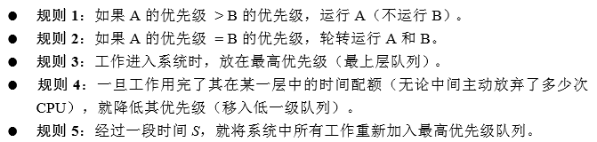

## 第2章 操作系统介绍

这一章介绍了操作系统发展的历史, 介绍了本书要将的三个部分: 虚拟化, 并发, 持久性.

虚拟化的意义在于**使得系统更易于使用**. 如果我们只有一个逻辑上的CPU, 那么我们"同时"只能运行一个程序, 这将会使得计算机非常难用. 

**操作系统将物理资源(处理器, 内存, 磁盘)转换为更通用, 更强大, 更易于使用的虚拟形式**. 

书中用了两个c程序例子分别介绍虚拟化CPU和内存. 

还有一个并发程序, 通过同时运行两个线程对同一个数据进行操作, 导致该数据非正常变化. **暴露了常见的并发问题**

关于持久性的讨论, 书中描述位**我们需要硬件和软件来持久化地存储数据**

在持久化程序中, 了解到操作系统使用**文件描述符(fd)**来对文件进行操作. 比如默认情况下每个进程都有3个fd, 分别用于标准输入, 输出和粗欧文.

最后提出了三个设计目标: 建立抽象, 提供高性能, 提供程序保护.

## 第4章 抽象: 进程

 **时分共享CPU技术**: 让一个进程只运行一个时间片, 然后切换到其他进程. 

开销: 性能损失, 程序运行更慢(时间更少了)

上下文切换: 停止运行一个程序, 并运行另一个程序

**进程的机器状态**: 内存, 寄存器

进程创建的过程, 细节: 将代码和静态数据加载到内存中, 加载到进程的地址空间中. 

现代操作系统**惰性执行**加载过程

三种进程状态: **运行, 就绪, 阻塞**

一系列模拟作业: 运行作者提供的python程序文件, 就可以模拟进程的调度. 进程在三种状态间切换. 通过使用不同的参数, 实现了各种不同的进程运行情况.

## 第5章 插叙: 进程API

介绍了三种系统调用函数: fork(), wait(), exec(). 并通过几个例子描述了他们的用法.

这一章的作业是使用系统调用进行一些特定程序的设计. 还挺有意思.

## 第6章 机制: 受限直接执行

### 黑箱

**通过这样一种机制, 操作系统可以限制进程可以执行的操作(保证操作系统的控制权), 从而实现进行的调度, 并保证高性能. 进程要使用限制操作, 需要通过执行陷阱指令来调用系统调用, 陷入内核执行受限操作**

### 概念

**受限**: 对操作系统来说, 进程受限意味着操作系统可以控制进程. 操作系统提供受限的操作供进程调用.

**直接执行**: 直接在CPU上运行程序*(有点不太理解不是直接在CPU上运行程序指的是什么...)*

**执行模式**: 由硬件控制. 分为用户模式和内核模式. 

**陷阱(trap)指令**: 程序要进行系统调用时需要执行的指令. 执行陷阱指令将会跳入内核, 并将特权级别提升为内核模式.

**调用者寄存器**: 执行陷阱时, 需要储存足够的调用者寄存器, 以变正确返回.

**上下文**: 进程的状态信息.

### 问题与方法

Q: 如何进行进程的切换?

A: 让**能够控制CPU的操作系统**进行调度

Q: 操作系统如何获取CPU的控制权?

A: 一种不成熟的方式: 协作方式: 等待进程进行系统调用将控制权转移给操作系统.  

A: 更好的方式: **利用时钟中断重新获取控制权**.

Q: 为什么要保存和恢复上下文

A: 保存和恢复上下文是所谓的**上下文切换**. 因为一个进程在执行的过程中, 会使用很多寄存器, 这代表了它的状态. 

Q: 上下文切换要进行多长时间?

A: 这是一个作业, 仔细研究了再回答.

## 第7章 进程调度: 介绍

### 黑箱

**基于一些理想化的假设, 提出了四种进程调度的方法, 从简单到稍微复杂.  提出这些模型并非毫无根据, 而是以一些性能指标为目标, 如周转时间, 响应时间. 但在现代操作系统中, 我们并不追求这种单一的指标, 而要考虑更加系统的问题. 比如前三种调度算法, 都无法做到这部分的主题: 虚拟化CPU. 这个黑箱能进行简单的系统调用, 但无法有效地进行系统调用**

### 概念

**周转时间**: T完成时间 - T到达时间

**护航效应**

**响应时间**: 首次运行时间 - 到达时间

**时间片**: 调度量子

### 方法

**1. 先进先出(FIFO)**: 先到达的进程先执行.

问题: 可能会产生**护航效应**

**2. 最短任务优先(SJF)**: 同一时间先执行时间最短的任务. 

问题: 当短任务在长时间任务执行之后到达, 那么短任务需要等待长任务执行完后才能执行. 依然会造成护航效应. 

**3. 最短完成时间优先(STCF)**: 抢占式调度程序, 选择所有进程中完成时间最短的一个进行.

问题: 时钟执行最短完成时间的程序, 那么时间长的程序将会无法执行.

**上述三种调度方法都有明显的问题: 当执行一个进程时, 会一直执行这个程序直到完成** 这明显是不可取的, 因为这样无法做到**虚拟化CPU**. 

Q: 如何构建对

**4. 轮转(RR)**: 以时间片为基本单位, 每个进程轮流执行一个时间片, 从而"轮转". 

时间片不能太短, 虽然短的时间片可以得到很小的响应时间, 但是上下文切换太过频繁会有较大的成本. 

**问题总结**: 前面这四种调度算法有意义吗? 他们有作用吗? 

**A**: 事实上, 1-3的前提都是知道每个工作的长度, 这显然是不现实的. 所以这几种方法是不现实的. 而方法4这种轮转的技术, 和时分共享非常类似. 可以认为是有一些意义的.

## 第8章 调度: 多级反馈队列

### 黑箱

**输入: 没有有效进程调度的操作系统**

**输出: 使用了MLFQ调度方法的操作系统, MLFQ最终由5个规则构成, 它不需要预知工作的市场, 且能够有效地调度进程, 保证每个进程都能公平, 合理地被调度. 合理的处理了交互性进程的调度, CPU密集型进程的调度**

### 概念

**MLFQ**: 多级反馈队列

**巫毒常量**: 一种似乎需要一些黑魔法才能正确设置的值. 如每过时间S将所有进程提升到最高优先级的S.

**Qusterhout定律**: 提示: 我们可以有一个写满各种参数值默认值的配置文件, 使得系统管理员可以方便地进行修改.

### 方法

**1. 简单的多级反馈**: 

0. 不同优先级的队列保存着各种进程
1. 首先运行优先级高的进程
2. 同等优先级的进程轮转进行
3. 进程进入系统时, 放在最高优先级
4. 用完整个时间片后, 下调进程的优先级
5. 如果进程在使用完整个时间片之前主动释放CPU, 那么优先级不变

**问题**: 

1.  **饥饿问题**: 如果存在很多的交互性进程, 就会不断地占用CPU, 导致长进程无法执行, 会被饿死. 
2.  **恶意进程**: 一个进程可能在99%的时间片的时候主动放弃CPU, 从而保持优先级不变. 这种行为会导致该进程使用过多的CPU资源.

**解决方法**:

1. 针对饥饿问题, 我们经过一定**时间S**, 将系统中所有的工作加入到最高优先级队列. 
2. 针对恶意进程, 我们使用更好的计时方式. **一旦工作用完了其在某一层中的时间配额, 那么就降低其优先级**. 无论它是否是多次主动放弃了CPU

**新的问题**  

如何设置**时间S**. 

## 总结

MLFQ最后的规则是:

