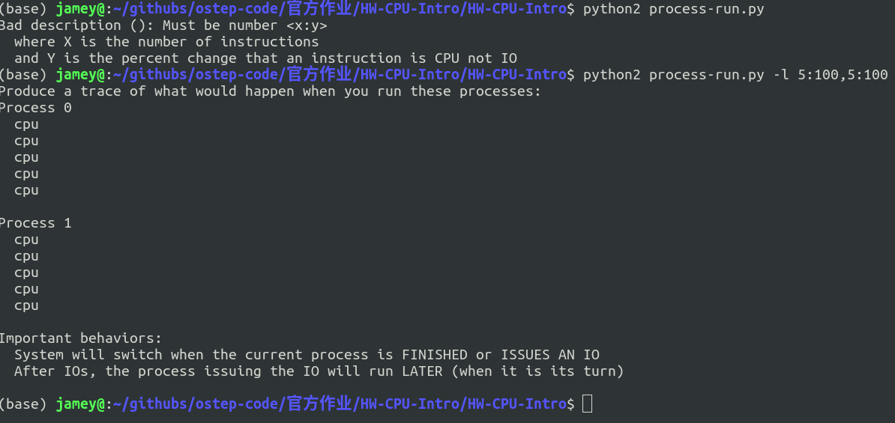
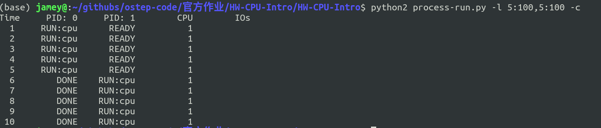
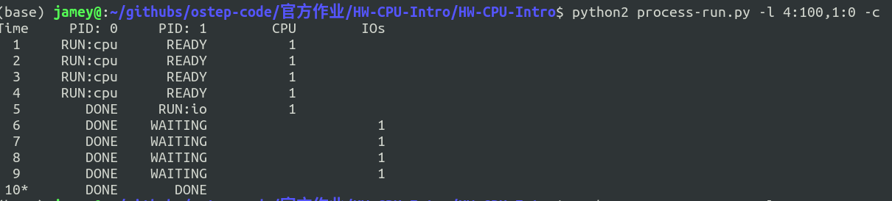
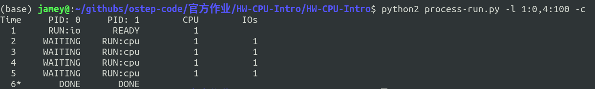
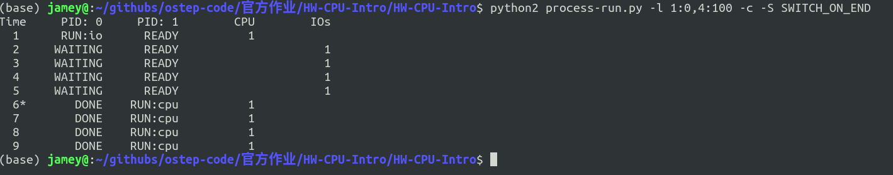
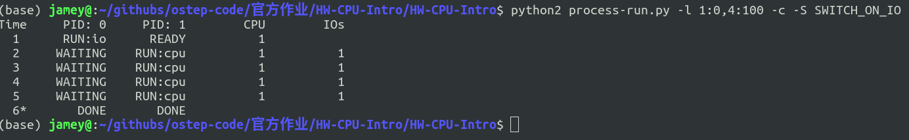

[TOC]

# 操作系统第一次作业

**计科1702 - 吴嘉豪 - 201708010407**

## 4.1

命令行上运行结果如图所示

通过查看`README-process-run`文件, 获知各个参数的含义

>   -l PROCESS_LIST, --processlist=PROCESS_LIST
>                         a comma-separated list of processes to run, in the
>                         form X1:Y1,X2:Y2,... where X is the number of
>                         instructions that process should run, and Y the
>                         chances (from 0 to 100) that an instruction will use
>                         the CPU or issue an IO

可知, `-l`代表进程列表, 接形如`X1:Y1,X2:Y2`的进程信息. 其中, X代表进程需要运行的指令个数, Y则是某一指令是使用CPU还是请求一个IO的chance(机会), 当Y为100时, 指令全部使用CPU, 当Y为0时, 指令全部为请求IO. 0<Y<100时, 根据大小按比例分配. 

**因此, 执行 `./process-run.py -l 5:100,5:100` 时, 进程一调用五次CPU后, 进程二再调用五次CPU. CPU的利用率为100%.** 

利用-c参数查看答案, 可知CPU利用率确实为100%

## 4.2

完成这两个指令需要9个时间单位, 4:100 使用4个时间单位, 1:0使用了5个时间单位, 其中一个占用CPU, 发起IO请求, 然后IO等待4个时间单位后结束.

## 4.3

调换顺序后, CPU和IO的利用率大大提高. 如图所示.

交换顺序很重要, 因为在第一种情况下, 先占用了4个时间单位的CPU, 再执行进程二占用了一次CPU和4次IO. 要知道, 在请求到IO中断时, 我们可以同时使用CPU. 第一种情况导致前期IO闲置, 后期CPU闲置. 浪费了很多的资源. 而交换后的调度使得在请求IO的时候, 能够一直使用CPU. 因此IO和CPU的利用率都非常高. **因此合理的交换进程的执行顺序可能会大大提高资源利用率**

## 4.4

这个参数使得CPU和IO不能同时利用. 因此他会先执行进程一, 完全执行结束之后才开始执行进程二. 导致CPU和IO的利用率下降很多. 因为CPU和IO本可以同时执行的.

## 4.5

和4.4不同的是, 等待IO的时候会执行下一个进程, 这是该作业程序的默认模式. 这种模式下, CPU和IO的利用率大大提高. 

