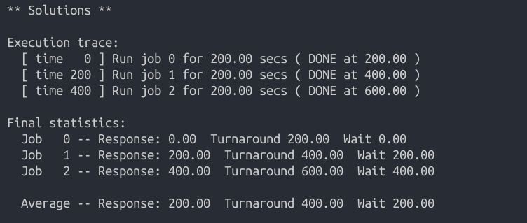
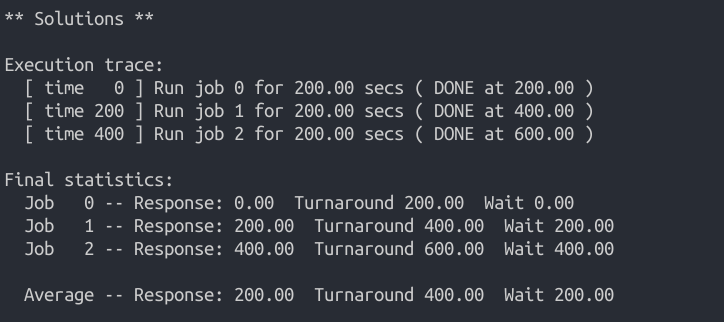
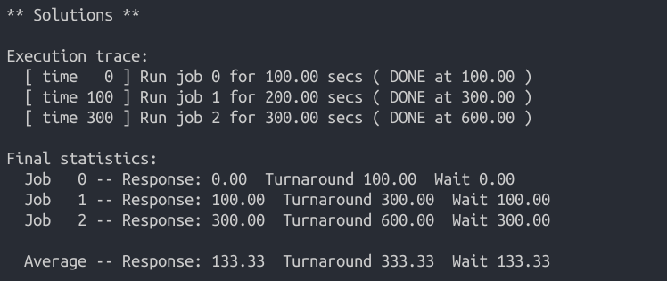
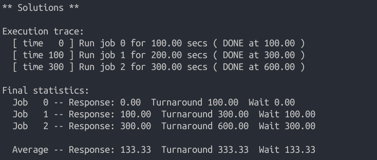
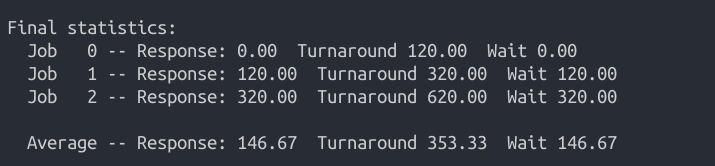

[TOC]

# 操作系统第二次作业

**201708010407-吴嘉豪**

## 作业安排

> 操作系统:
>   第五章：5.1 5.2  5.4
>   第七章：7.1~7.7
> 提交方式：电子档(word,pdf两份）
> 文件命名：学号-姓名
> 提交时间：10月8号晚上22：00前

## 7.1

**FIFO**: 

1. 响应时间: 0, 200, 400
2. 平均响应时间: 200
3. 周转时间: 200, 400, 600
4. 平均周转时间: 400

运行命令`python2 scheduler.py -p FIFO -l 200,200,200 -c`查看结果.

**SJF**:

1. 响应时间: 0, 200, 400
2. 平均响应时间: 200
3. 周转时间: 200, 400, 600
4. 平均周转时间: 400

运行命令`python2 scheduler.py -p SJF -l 200,200,200 -c`查看结果

## 7.2

**FIFO**: 

1. 响应时间: 0, 100, 300
2. 平均响应时间: 133.33
3. 周转时间: 100, 300, 600
4. 平均周转时间: 333.33

运行命令`python2 scheduler.py -p FIFO -l 100,200,300 -c`查看结果.

**SJF**: 

1. 响应时间: 0, 100, 300
2. 平均响应时间: 133.33
3. 周转时间: 100, 300, 600
4. 平均周转时间: 333.33

运行命令`python2 scheduler.py -p SJF -l 100,200,300 -c`查看结果.

## 7.3

对`100, 200, 300`这三个作业使用**RR调度**

1. 响应时间: 0, 1, 2
2. 平均响应时间: 1
3. 周转时间: 298, 499, 600
4. 平均周转时间: 465.67

使用命令`python2 scheduler.py -p RR -l 100,200,300 -q 1 -c`查看结果

## 7.4

在满足下面几个对工作负载的假设的前提下:

1．每个工作的运行时间是已知的。
2．所有的工作同时到达。
3．一旦开始，每个工作保持运行直到完成。
4．所有的工作只是用 CPU（即它们不执行 IO 操作）。

对于作业按运行长度**非递减顺序增长**的工作负载, SFJ提供与FIFO相同的周转时间. 

## 7.5

假设有n个顺序到达的作业, 工作长度分别为J1, J2, J3, ... , Jn. Q为RR调度的量子长度. 则

**当J1 = J2 = J3 = ... = Jn-1 = Q时, SJF与RR提供相同的响应时间**

## 7.6

**除长度最长的工作以外, 其他工作随着工作长度的增加, SJF的响应时间会增加**. 

**如果增加工作长度最长的工作的长度, 那么SJF的响应时间不会增加**

对于`100, 200, 300`的作业, 模拟程序结果如下

对于作业`120, 200, 300`的作业, 模拟程序结果如下

对于作业`120, 240, 300`的作业, 模拟程序结果如下

对于作业`120, 240, 360`的作业, 模拟程序结果如下

## 7.7

随着量子长度的增加, RR的响应时间会增加.

假设n个作业的工作长度分别为$J_1, J_2, J_3, ..., J_n$, 量子长度为$Q$, 那么总的**响应时间之和$T_{res}$**可以表示为

**$T_{res} = \sum_{i = 1}^{n}min(J_i, Q)$ **