[TOC]

# 操作系统第二次作业

**201708010407-吴嘉豪**


## 作业安排

> 操作系统:
>      第五章：5.1 5.2  5.4
>      第七章：7.1~7.7
> 提交方式：电子档(word,pdf两份）
> 文件命名：学号-姓名
> 提交时间：10月8号晚上22：00前


## 5.1

答: 设置初始`x = 100`, 在子进程中将x减一, 在父进程中将x加三, 最后的结果是, **子进程和父进程中的变量相互独立, 互不影响.** 因此子进程中x的值从100变成99, 父进程中的值从100变成103.

执行结果如图所示

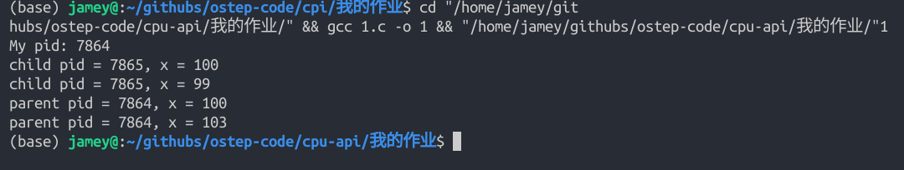

代码如下

```c
#include <stdio.h>
#include <unistd.h>
#include <sys/wait.h>

int main() {
    printf("My pid: %d\n", getpid());
    int x = 100;
    int child = fork();  // ! fork() 函数是在unistd.h 中的!
    if (child < 0) {  // fork失败
        printf("fork error !\n");
    } else if (child == 0) {  // fork成功, 子进程
        printf("child pid = %d, x = %d\n", getpid(), x);
        x--;
        printf("child pid = %d, x = %d\n", getpid(), x);
    } else {
        wait(NULL); // ! wait() 是在 <sys/wait.h> 中
        printf("parent pid = %d, x = %d\n", getpid(), x);
        x += 3;
        printf("parent pid = %d, x = %d\n", getpid(), x);
    }
}
```


## 5.2

答: 子进程和父进程都可以访问open()返回的文件描述符. 因为文件是独立于进程存在的.

如果并发分别写入一行字符, 那么将分别写入一行字符. **看似互不影响**

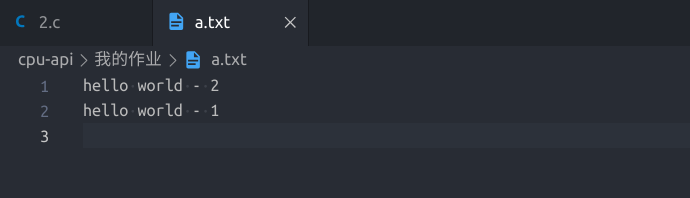

如果分别在循环中写入100行字符, 如图所示

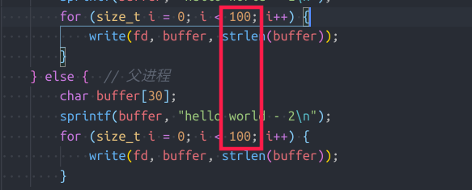

那么父进程和子进程中**每一个write交替写入文件**, 但是总的写入次数100+100 = 200不变. 


尝试超高并发写入文件的情况. 在每个进程中并行的写入**一百万行字符**. 

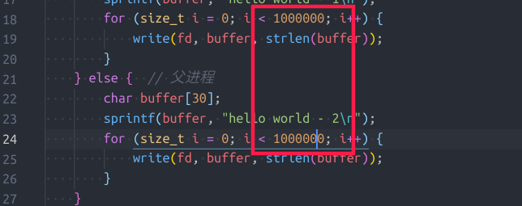

查看结果, 发现**依然成功地写入了两百万行字符**. 并没有出现漏写入的情况. 子进程和父进程中每一行的写入依然是交替进行的.

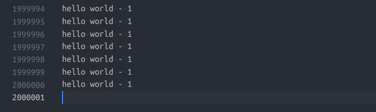

代码如下:

```c
#include <assert.h>
#include <fcntl.h>  // ! 有这个才能调用open函数!
#include <stdio.h>
#include <string.h>
#include <sys/stat.h>
#include <sys/types.h> /*提供类型pid_t,size_t的定义*/
#include <sys/wait.h>
#include <unistd.h>

int main() {
    int fd    = open("a.txt", O_WRONLY | O_CREAT | O_TRUNC, S_IRUSR | S_IWUSR);
    int child = fork();
    if (child < 0) {  // 打开失败
        printf("error\n");
    } else if (child == 0) {  // 子进程
        char buffer[30];
        sprintf(buffer, "hello world - 1\n");
        for (size_t i = 0; i < 100; i++) {
            write(fd, buffer, strlen(buffer));
        }
    } else {  // 父进程
        char buffer[30];
        sprintf(buffer, "hello world - 2\n");
        for (size_t i = 0; i < 100; i++) {
            write(fd, buffer, strlen(buffer));
        }
    }
    close(fd);
}
```


## 5.4

> 1. 带l 的exec函数：execl,execlp,execle，表示后边的参数以可变参数的形式给出且都以一个空指针结束
> 2. 带 p 的exec函数：execlp,execvp，表示第一个参数path不用输入完整路径，只给出命令名即可，它会在环境变量PATH当中查找命令
> 3. 不带 l 的exec函数：execv,execvp表示命令所需的参数以char *arg[]形式给出且arg最后一个元素必须是NULL
> 4. 带 e 的exec函数：execle表示，将环境变量传递给需要替换的进程
>
> **以上四点引用自:** [https://blog.csdn.net/mantis_1984/article/details/52710443](https://blog.csdn.net/mantis_1984/article/details/52710443)

**问: 为什么同样的基本调用会有这么多种变种?**

**答: 从上面的四点对命令的解释可以知道, 调用exec的形式有很多, 不同的exec变体功能都是一样的, 但形式不一样, 比如有以下多种情况:**

1. 直接使用ls命令
2. 或者写出完整的路径/bin/ls
3. 是否添加自定义的环境变量
4. 是将命令的每个部分分开来传递
5. 还是先写入到一个`char *argv[]`中然后传递

这符合我们调用程序的多种习惯和系统组织程序调用(Path)的方式.


**下面是使用man命令得到的各个调用的原型**

```c
int execl(const char *path, const char *arg, ...
          /* (char  *) NULL */);
int execlp(const char *file, const char *arg, ...
           /* (char  *) NULL */);
int execle(const char *path, const char *arg, ...
           /*, (char *) NULL, char * const envp[] */);
int execv(const char *path, char *const argv[]);
int execvp(const char *file, char *const argv[]);
int execvpe(const char *file, char *const argv[],
            char *const envp[]);
```

**下面展示在子进程中使用各种exec变体调用ls的方式**

1. execl: 

    ```c
    execl("/bin/ls", "ls", NULL);
    ```

2. execle(可传递自定义的环境变量)

    ```c
    char const *envpath[] = {"PATH=/bin", "AA=/usr", NULL};
    execle("/bin/ls", "ls", NULL, envpath);
    ```

3. execlp

    ```c
    execlp("/bin/ls", "ls", NULL);
    ```

    或者

    ```c
    execlp("ls", "ls", NULL);
    ```

4. execv

    ```c
    char *myargs[2];
    myargs[0] = strdup("ls");
    myargs[1] = NULL;
    execv("/bin/ls", myargs);
    ```

5. execvp

    ```c
    char *myargs[2];
    myargs[0] = strdup("ls");
    myargs[1] = NULL;
    execvp("ls", myargs);
    // 或者 execvp("/bin/ls", myargs);
    ```

执行的结果都是(正确打印出了文件列表):

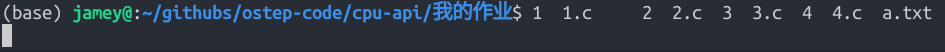


## 7.1

**FIFO**: 

1. 响应时间: 0, 200, 400
2. 平均响应时间: 200
3. 周转时间: 200, 400, 600
4. 平均周转时间: 400

运行命令`python2 scheduler.py -p FIFO -l 200,200,200 -c`查看结果.

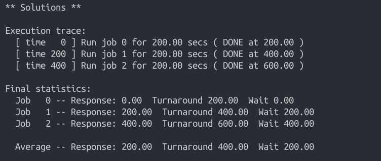

**SJF**:

1. 响应时间: 0, 200, 400
2. 平均响应时间: 200
3. 周转时间: 200, 400, 600
4. 平均周转时间: 400

运行命令`python2 scheduler.py -p SJF -l 200,200,200 -c`查看结果

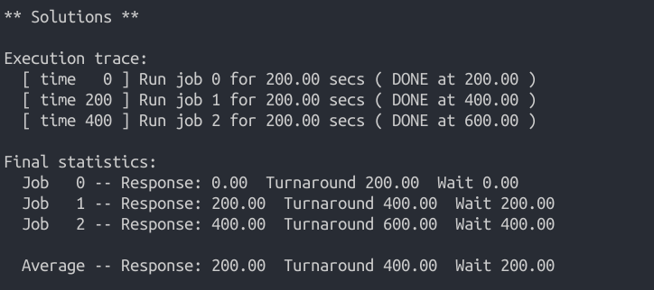


## 7.2

**FIFO**: 

1. 响应时间: 0, 100, 300
2. 平均响应时间: 133.33
3. 周转时间: 100, 300, 600
4. 平均周转时间: 333.33

运行命令`python2 scheduler.py -p FIFO -l 100,200,300 -c`查看结果.

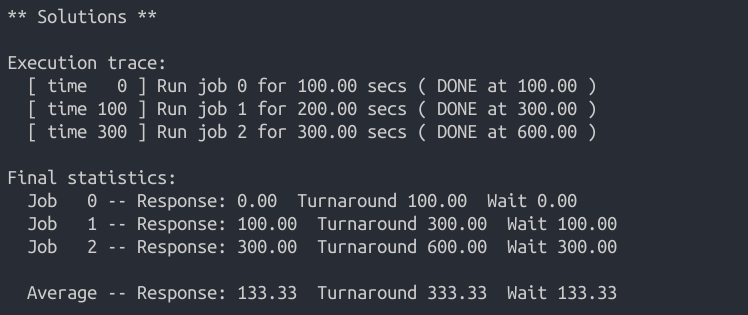

**SJF**: 

1. 响应时间: 0, 100, 300
2. 平均响应时间: 133.33
3. 周转时间: 100, 300, 600
4. 平均周转时间: 333.33

运行命令`python2 scheduler.py -p SJF -l 100,200,300 -c`查看结果.


## 7.3

对`100, 200, 300`这三个作业使用**RR调度**

1. 响应时间: 0, 1, 2
2. 平均响应时间: 1
3. 周转时间: 298, 499, 600
4. 平均周转时间: 465.67

使用命令`python2 scheduler.py -p RR -l 100,200,300 -q 1 -c`查看结果

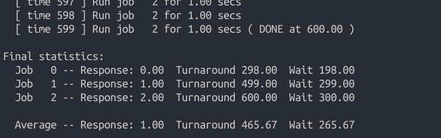


## 7.4

在满足下面几个对工作负载的假设的前提下:

1．每个工作的运行时间是已知的。
2．所有的工作同时到达。
3．一旦开始，每个工作保持运行直到完成。
4．所有的工作只是用 CPU（即它们不执行 IO 操作）。

对于作业按运行长度**非递减顺序增长**的工作负载, SFJ提供与FIFO相同的周转时间. 


## 7.5

假设有n个顺序到达的作业, 工作长度分别为J1, J2, J3, ... , Jn. Q为RR调度的量子长度. 则

**当J1 = J2 = J3 = ... = Jn-1 = Q时, SJF与RR提供相同的响应时间**


## 7.6

**除长度最长的工作以外, 其他工作随着工作长度的增加, SJF的响应时间会增加**. 

**如果增加工作长度最长的工作的长度, 那么SJF的响应时间不会增加**


对于`100, 200, 300`的作业, 模拟程序结果如下

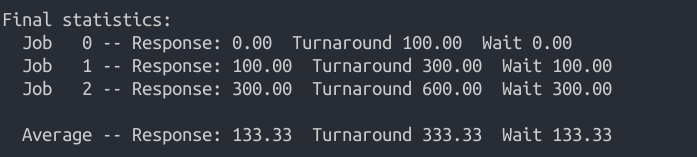

对于作业`120, 200, 300`的作业, 模拟程序结果如下

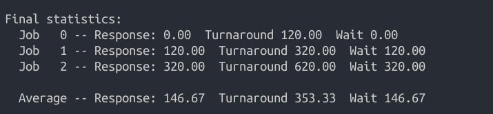

对于作业`120, 240, 300`的作业, 模拟程序结果如下

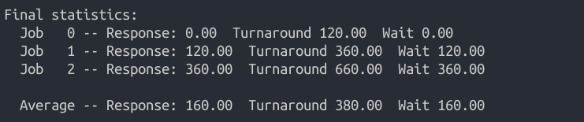

对于作业`120, 240, 360`的作业, 模拟程序结果如下

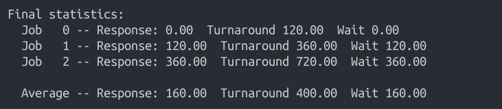


## 7.7

随着量子长度的增加, RR的响应时间会增加.

假设n个作业的工作长度分别为$J_1, J_2, J_3, ..., J_n$, 量子长度为$Q$, 那么总的**响应时间之和$T_{res}$**可以表示为

**$T_{res} = \sum_{i = 1}^{n}min(J_i, Q)$ **


