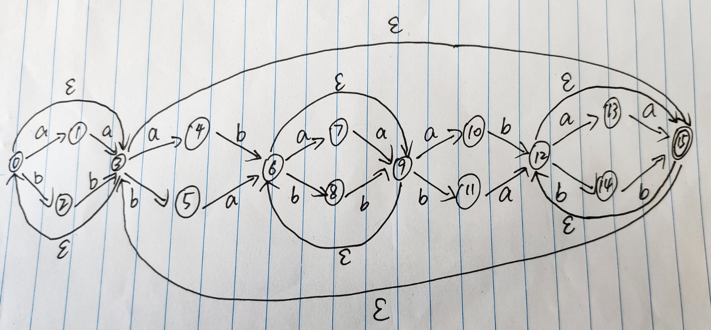
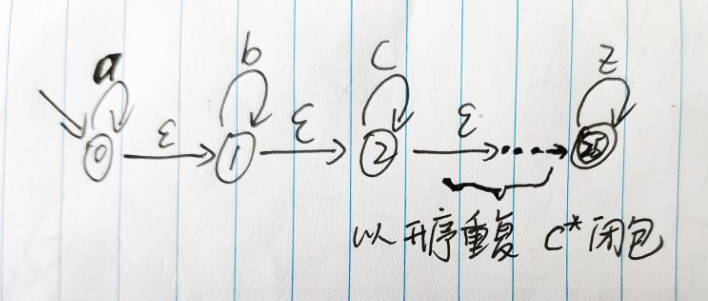
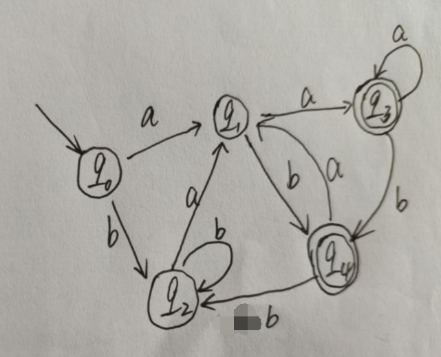

[TOC]

# 第二次作业

***计科1702-吴嘉豪-201708010407***


## 作业


## 词法分析简介

### 3.1.1

id: 函数名, 变量名

number: 数字

```py
<float> <id, limitedSquaare> <(> <id, x> <)> <{>
	<float> <id, x>
	<return> <(> <id, x> <"<="> <number, -10.0> <||> <id, x> <">="> 		<number, 10.0> <)> <?> <number, 100> <:> <id, x> <*> <id, x>
<}>
```

上面的例子有两类类词素有相关联的词法值, 分别为**函数名变量名等代表的id, 数字number.** 

1. 假设有一个id的词法单元为$id\_name$, 那么它可写成这样的名字-属性对序列: $<id, id\_name\_pointer>$, $id\_name\_pointer$**为指向符号表中$id\_name$的条目的指针.**
2. 假设有一个number的, 那么**它的值为它的数值本身.**


### 3.1.2

```py
<text, "Here is a photo of"> <nodestart, b> <text, "my house"> <nodeend, b> <text, ";">
<nodestart, p> <selfendnode, img> <selfendnode, br>
<text, "see"> <nodestart, a> <text, "More Picture"> <nodeend, a>
<text, "if you liked that one."> <nodeend, p>
```

文本text应当有相关联的词法值, 值为文本.

结点的开始和结束应有相关联的词法值, 值为该节点的类别.


## 正则表达式

### 3.3.2

```python
1) 以a为开头, a为结尾, 中间为任意个a或b字符的字符串.

2) 由任意个a或b组成的字符串

3) 由a或b组成的且倒数第三个字符是a的字符串

4) 由字符a(可以没有), b组成的且有且只有3个b的字符串

5) 包含偶数个a, b的字符串
```


### 3.3.5

```py
1. 定义字符集S为非元音字符
   (S|a)*a(S|e)*e(S|i)*i(S|o)*o(S|u)*u

2. a*b*c*d* ... x*y*z*

3. /\* ([^*"]* | ".*" | \*+[^/])* \*/
解释:
分成三个部分来看, 首先是开头/\*, 用\对*进行转义, 表示以字符串 /* 开头
第三部分是\*/, 表示以字符串 */ 结尾
中间部分是 ([^*"]*|".*"|\*+[^/])*, 表示注释的内容. 它由三种可能, 用或| 连接.
三种可能分别是:
	1) 除 *, " 以外的字符, 如果不排除 ", 则会影响第二点引号的包裹. 如果不排除 *, 则可能会与 / 连		接不满足条件. *的出现包含在第三点的限制条件中.
	2) 任意以" " 包裹的字符串, 其中包括了题目描述的在双引号中的 */
	3) 以一个或多个*开始的, 且连接着非 / 的字符串, 排除括号外 */ 的情况

9. (ε|b)*(a|aba)*(ε|b)
```


### 3.3.11

| sh文件名表达式 | 正则表达式          | 解释                                 |
| -------------- | ------------------- | ------------------------------------ |
| 's'            | `'s'`               |                                      |
| \c             | `c`                 |                                      |
| *              | `(C1|C2|C3...|Cn)*` | C代表支持的字符集, 分别为C1, C2, ... |
| ?              | `C1|C2|C3...|Cn`    | 同上                                 |
| [s]            | `S1|S2|S3...|Sn`    | S1,S2...Sn分别为S中的字符            |


## 转移图

### 3.4.1

1.  

    

2. 


3. 


4. 


5. 




### 3.4.2

1. 

```py
定义字符集S为非元音字符
   (S|a)*a(S|e)*e(S|i)*i(S|o)*o(S|u)*u
```


2. `a*b*c*d* ... x*y*z*`



3. 

`/\*([^*"]*|".*"|\*+[^/])*\*/`


9. 

`(ε|b)*(a|aba)*(ε|b)`


## 自动机

### 3.6.2

1. 设计NFA

    ```py
    定义字符集S为非元音字符
       (S|a)*a(S|e)*e(S|i)*i(S|o)*o(S|u)*u
    ```

    

2. 设计NFA

    `a*b*c*d* ... x*y*z*`

    

3. 设计NFA

    `/\*([^*"]*|".*"|\*+[^/])*\*/`

4. 设计NFA

    `(ε|b)*(a|aba)*(ε|b)`

    


### 3.6.3

所有的匹配路径为

```py
1) s0 ---> s0 ---> s0 ---> s0 ---> s0

2) s0 ---> s0 ---> s1 ---> s1 ---> s1

3) s0 ---> s1 ---> s1 ---> s1 ---> s1

4) s0 ---> s1 ---> s2 ---> s2 ---> s2

5) s0 ---> s1 ---> s2 ---> s2 ---> s3

6) s0 ---> s1 ---> s2 ---> s0 ---> s0 ---> s0

7) s0 ---> s1 ---> s2 ---> s2 ---> s0 ---> s0
```

从上面7条路径来看, 路径5的最后一个结点为s3, 是NFA中的终结状态. 因此**这个NFA接受aabb**


### 3.6.4

所有的匹配路径为

```py
s0 ---> s1 ---> s0 ---> s1 ---> s2 ---> s3

s0 ---> s1 ---> s0 ---> s1 ---> s2 ---> s1 ---> s2

s0 ---> s1 ---> s0 ---> s1 ---> s0 ---> s3 ---> s2 ---> s3 ---> s2 ---> s3

s0 ---> s1 ---> s0 ---> s1 ---> s0 ---> s3 ---> s2 ---> s1 ---> s2 ---> s3

s0 ---> s1 ---> s0 ---> s1 ---> s0 ---> s3 ---> s2 ---> s1 ---> s2 ---> s1 ---> s2

s0 ---> s1 ---> s0 ---> s3 ---> s0 ---> s3 ---> s2 ---> s3 ---> s2 ---> s3

s0 ---> s1 ---> s0 ---> s3 ---> s0 ---> s3 ---> s2 ---> s1 ---> s2 ---> s3

s0 ---> s1 ---> s0 ---> s3 ---> s0 ---> s3 ---> s2 ---> s1 ---> s2 ---> s1 ---> s2

s0 ---> s3 ---> s0 ---> s1 ---> s2 ---> s3

s0 ---> s3 ---> s0 ---> s1 ---> s2 ---> s1 ---> s2

s0 ---> s3 ---> s0 ---> s1 ---> s0 ---> s3 ---> s2 ---> s3 ---> s2 ---> s3

s0 ---> s3 ---> s0 ---> s1 ---> s0 ---> s3 ---> s2 ---> s1 ---> s2 ---> s3

s0 ---> s3 ---> s0 ---> s1 ---> s0 ---> s3 ---> s2 ---> s1 ---> s2 ---> s1 ---> s2

s0 ---> s3 ---> s0 ---> s3 ---> s0 ---> s3 ---> s2 ---> s3 ---> s2 ---> s3

s0 ---> s3 ---> s0 ---> s3 ---> s0 ---> s3 ---> s2 ---> s1 ---> s2 ---> s3

s0 ---> s3 ---> s0 ---> s3 ---> s0 ---> s3 ---> s2 ---> s1 ---> s2 ---> s1 ---> s2
```

观察上面的16条路径, 发现有很多以状态s3(终结状态)为结束的路径. 因此**这个NFA接受aabb**


## RE -> NFA; NFA -> DFA

### 3.7.1

1) **子集构造过程**

```py
q0 = {s0, s1, s3}
q0 --a-> {s2} --ε-> {s2} = q1
q0 --b-> {s4} --ε-> {s4} = q2
q1 --a-> {s2} --ε-> {s2} = q1
q1 --b-> {}
q2 --a-> {}
q2 --b-> {s4} --ε-> {s4} = q2
```

因此DFA为:


2) **子集构造过程**

```py
q0 = {s0}
q0 --a-> {s0, s1} --ε-> {s0, s1} = q1
q0 --b-> {s0} --ε-> {s0} = q0
q1 --a-> {s0, s1, s2} --ε-> {s0, s1, s2} = q2
q1 --b-> {s0, s1} --ε-> {s0, s1} = q1
q2 --a-> {s0, s1, s2} --ε-> {s0, s1, s2} = q2
q2 --b-> {s0, s1, s2, s3} --ε-> {s0, s1, s2, s3} = q3
q3 --a-> {s0, s1, s2} --ε-> {s0, s1, s2} = q2
q3 --b-> {s0, s1, s2, s3} --ε-> {s0, s1, s2, s3} = q3
```

因此DFA为:


3) **子集构造过程**

```py
q0 = {s0} --ε-> {s0, s1, s2, s3} = q0
q0 --a-> {s0, s1} --ε-> {s0, s1, s2, s3} = q0
q0 --b-> {s2, s3} --ε-> {s0, s1, s2, s3} = q0
```

因此DFA为:


### 3.7.3

1) `(a|b)*`转化为NFA


NFA转DFA

首先进行**子集构造**

```py
q0 = {s0, s1, s2, s4, s7}
q0 --a-> {s3} --ε-> {s1, s2, s3, s4, s6, s7} = q1
q0 --b-> {s5} --ε-> {s1, s2, s4, s5, s6, s7} = q2
q1 --a-> {s3} --ε-> {s1, s2, s3, s4, s6, s7} = q1
q1 --b-> {s1, s2, s4, s5, s6, s7} = q2
q2 --a-> {s1, s2, s3, s4, s6, s7} = q1
q2 --b-> {s5} --ε-> {s1, s2, s4, s5, s6, s7} = q2
```

因此DFA为:


2) `(a*|b*)*`转化结果为


3) `((ε|a)b*)*`转化结果为


4) `(a|b)*abb(a|b)*`转化为NFA


## DFA最小化

### 3.9.4

1) `(a|b)*a(a|b)`

首先做出NFA图


使用子集构造算法化为DFA

```py
q0 = {s0, s1, s2, s4, s7}
q0 --a-> {s1, s2, s3, s4, s6, s7, s8, s9, s10, s12} = q1
q0 --b-> {s1, s2, s4, s5, s6, s7} = q2
q1 --a-> {s1, s2, s3, s4, s6, s7, s8, s9, s10, s11, s12, s14, s15} = q3
q1 --b-> {s1, s2, s4, s5, s6, s7, s13, s14, s15} = q4
q2 --a-> {s1, s2, s3, s4, s6, s7, s8, s9, s10, s12} = q1
q2 --b-> {s1, s2, s4, s5, s6, s7} = q2
q3 --a-> {s1, s2, s3, s4, s6, s7, s8, s9, s10, s11, s12, s14, s15} = q3
q3 --b-> {s1, s2, s4, s5, s6, s7, s13, s14, s15} = q4
q4 --a-> {s1, s2, s3, s4, s6, s7, s8, s9, s10, s12} = q1
q4 --b-> {s1, s2, s4, s5, s6, s7} = q2
```

DFA



经过**优化后最终得到**


2) `(a|b)*a(a|b)(a|b)`  <del>似乎写错了</del>

首先做出NFA图


使用子集构造算法化为DFA

```py
q0 = {s0, s1, s2, s4, s7}
q0 --a-> {s1, s2, s3, s4, s6, s7, s8, s9, s10, s12} = q1
q0 --b-> {s1, s2, s4, s5, s6, s7} = q2
q1 --a-> {s1, s2, s3, s4, s6, s7, s8, s9, s10, s11, s12, s14, s15, s16, s18} = q3
q1 --b-> {s1, s2, s4, s5, s6, s7, s13, s14, s15, s16, s18} = q4
q2 --a-> {s1, s2, s3, s4, s6, s7, s8, s9, s10, s12} = q1
q2 --b-> {s1, s2, s4, s5, s6, s7} = q2
q3 --a-> {s1, s2, s3, s4, s6, s7, s8, s9, s10, s11, s12, s14, s15, s16, s18, s17, s20, s21} = q5
q3 --b-> {s1, s2, s4, s5, s6, s7, s13, s14, s15, s16, s18, s19, s20, s21} = q6
q4 --a-> {s1, s2, s3, s4, s6, s7, s17, s20, s21} = q7
q4 --b-> {s1, s2, s4, s5, s6, s7, s19, s20, s21} = q8
q5 --a-> {s1, s2, s3, s4, s6, s7, s8, s9, s10, s11, s12, s14, s15, s16, s18, s17, s20, s21} = q5
q5 --b-> {s1, s2, s4, s5, s6, s7, s13, s14, s15, s16, s18, s19, s20, s21} = q6
q6 --a-> {s1, s2, s3, s4, s6, s7, s8, s9, s10, s11, s12, s14, s15, s16, s18, s17, s20, s21} = q5
q6 --b-> {s1, s2, s4, s5, s6, s7, s19, s20, s21} = q8
q7 --a-> {s1, s2, s3, s4, s6, s7, s8, s9, s10, s12} = q1
q7 --b-> {s1, s2, s4, s5, s6, s7} = q2
q8 --a-> {s1, s2, s3, s4, s6, s7, s8, s9, s10, s12} = q1
q8 --b-> {s1, s2, s4, s5, s6, s7} = q2
```

做出DFA


经过状态优化后


3) `(a|b)*a(a|b)(a|b)(a|b)`


参考:

1. https://github.com/fool2fish/dragon-book-exercise-answers