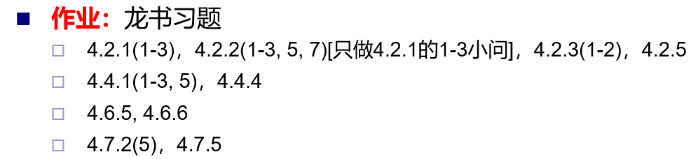
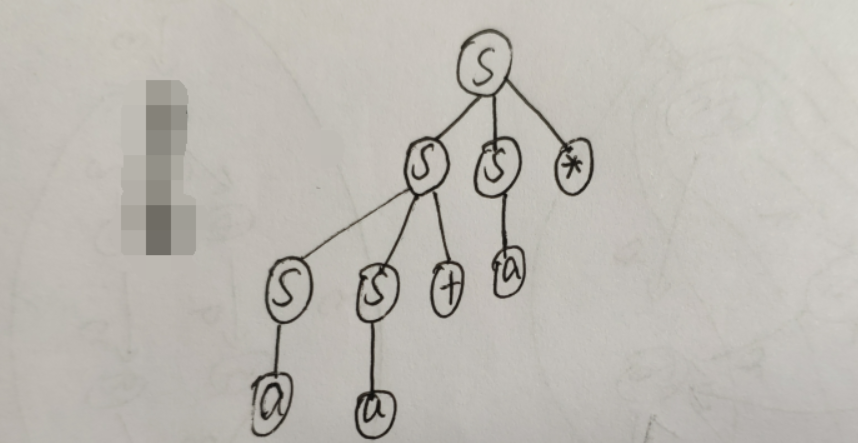
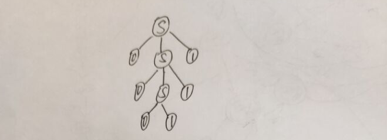
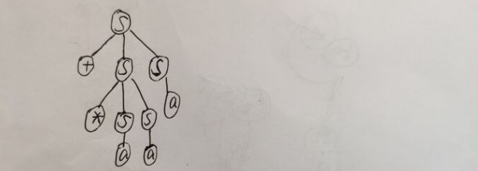
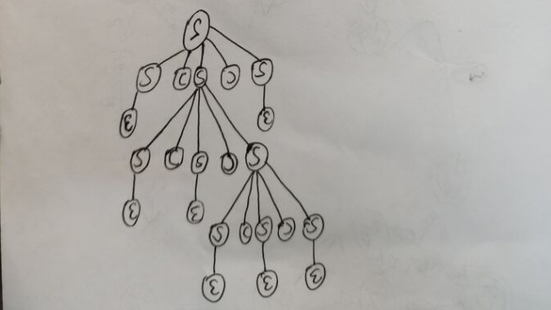
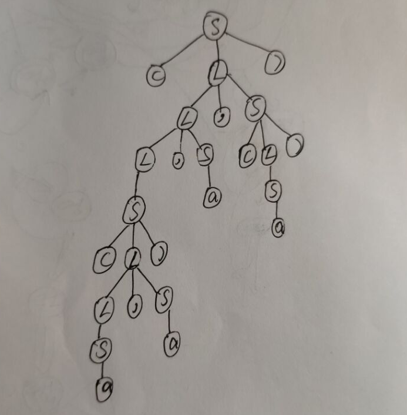

# 第三次作业

**吴嘉豪 - 201708010407**

[TOC]

## 作业




## 4.2.1

1. 

```sh
S -> SS* -> SS+S* -> aS+S* -> aa+S* -> aa+a*
```

2. 

```sh
S -> SS* -> Sa* -> SS+a* -> Sa+a* -> aa+a*
```

3. 




## 4.2.2

1. 最左推导:

    ```sh
    S -> 0S1 -> 00S11 -> 000111
    ```

    最右推导:

    ```
    S -> 0S1 -> 00S11 -> 000111
    ```

    语法分析树:

    

2. 最左推导:

    ```
    S -> +SS -> +*SSS -> +*aSS -> +*aaS -> +*aaa
    ```

    最右推导:

    ```
    S -> +SS -> +Sa -> +*SSa -> +*Saa -> +*aaa
    ```

    语法分析树:

    

3. 最左推导:

    ```
    S -> S(S)S -> (S)S -> (S(S)S)S -> ((S)S)S -> (()S)S -> (()S(S)S)S -> (()(S)S)S -> (()()S)S -> (()())S -> (()())
    ```

    最右推导:

    ```
    S -> S(S)S -> S(S) -> S(S(S)S) -> S(S(S)) -> S(S()) -> S(S(S)S()) -> S(S(S)()) -> S(S()()) -> S(()()) -> (()())
    ```

    语法分析树:

    

    

    5.最左推导:

    ```
    S -> (L) -> (L, S) -> (L, S, S) -> (S, S, S) ((L), S, S) -> ((L, S), S, S) -> ((S, S), S, S) -> ((a, S), S, S) -> ((a, a), S, S) -> ((a, a), a, S) -> ((a, a), a, (L)) -> ((a, a), a, (S)) -> ((a, a), a, (a))
    ```

    最右推导: 

    ```
    S -> (L) -> (L, S) -> (L, (L)) -> (L, (S)) -> (L, (a)) -> (L, S, (a)) -> (L, a, (a)) -> (S, a, (a)) -> ((L), a, (a)) -> ((L, S), a, (a)) -> ((L, a), a, (a)) -> ((S, a), a, (a)) -> ((a, a), a, (a))
    ```

    语法分析树:

    

    7. 最左推导:

    最右推导:

    语法分析树:

    

## 4.2.3

1. ```
    S -> S01 | S1 | ε
    ```

2. ```
    S -> 1S1 | 0S0 | ε
    ```

    

## 4.2.5

```
stmt -> if expr then stmt [ else stmt ]
		| begin stmtList end
		
stmtList -> {stmt;} stmt
```


## 4.4.1


## 4.4.4


## 4.6.5


## 4.6.6


## 4.7.2


## 4.7.5


