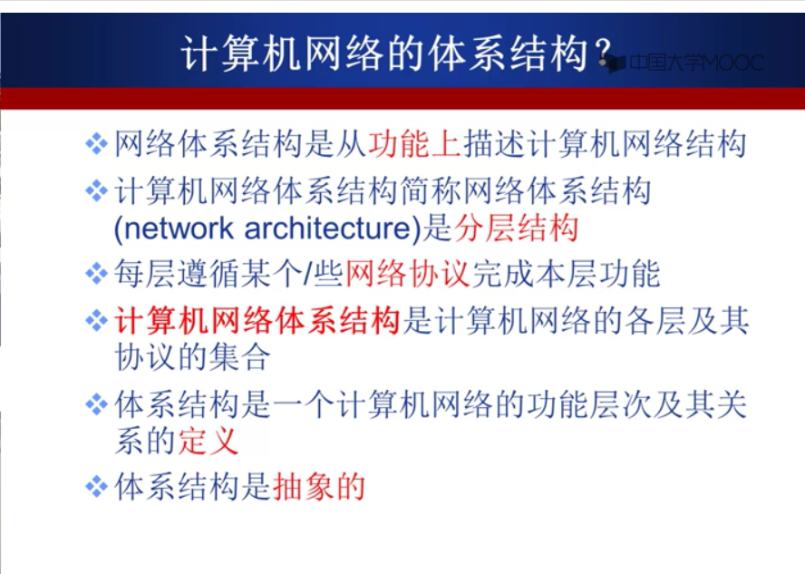

Q&A:

1. 为什么要有交换网络

    因为主机之间的距离可能很远, 网络的规模可能很大

2. 为什么要有协议(protocol)

    类比交通中的交通**规则**, 标志. 类比波特率的意义.

    协议三要素:

    1. 语法: 类比信件的格式
    2. 语义
    3. 时序

3. 网络结构

    1) 网络边缘

    ​	服务器也是边缘

    2) 接入网络, 物理介质

    3) 网络核心(核心网络)

4. 电路交换的多路复用
    1. 频分多路复用FDM
    2. 时分多路复用TDM
    3. 波分多路复用WDM(光的频分复用
    4. 码分多路复用CDM(解码, 内积)

5. 报文交换, 分组交换(统计多路复用)

    相对于报文交换, 分组交换的传输延迟更低. 

    分组交换有分组头

    分组交换对路由器的缓存要求比较低

6. 电路交换VS分组交换(现代广泛使用)

    电路交换会占用电路, 除非"拆除电路"

    分组交换充分共享资源, 更适合突发数据传输网络

    简单, 无需呼叫建立

7. 计算机网络性能

    1. 带宽/速率

    2. 四种延迟/时延: 结点处理延迟, 排队延迟, 传输延迟, 传播延迟

        <del>有点迷, 传输延迟和传播延迟是如何结合在一起计算, 怎么计算...</del>

        OK, 公开课上用高速公路的收费站类比: 放行时间, 开车时间

    3. 时延带宽积 = 传播时延 x 带宽

    4. 分组丢失(丢包)

    5. 吞吐量/率

8. 计算机网络体系结构

    从功能上描述计算机网络结构: 分层结构
   
   
   
   模块化分层, 相互独立
   
   协议是水平的(两个对等的实体)
   
   服务是垂直的
   
   
   
   为什么要进行数据封装: 增加控制信息(地址, 差错检测编码, 协议控制)
   
   <del>跳过了1.5的最后一个视频, 以后补充回看</del>

