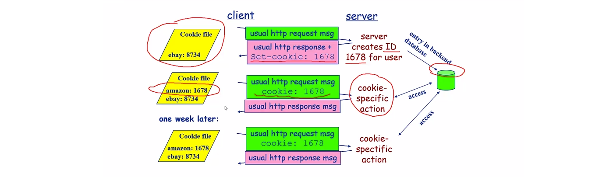
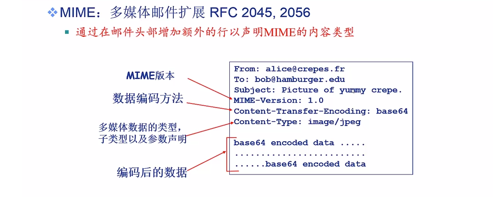
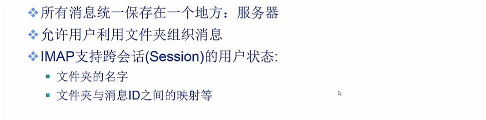
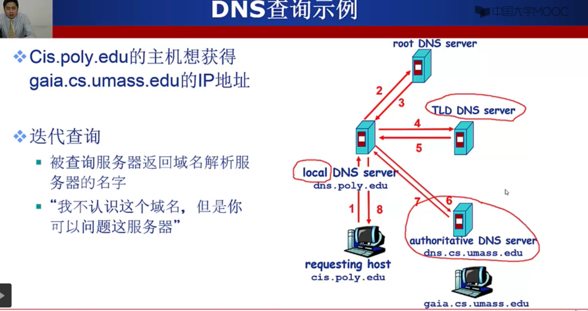
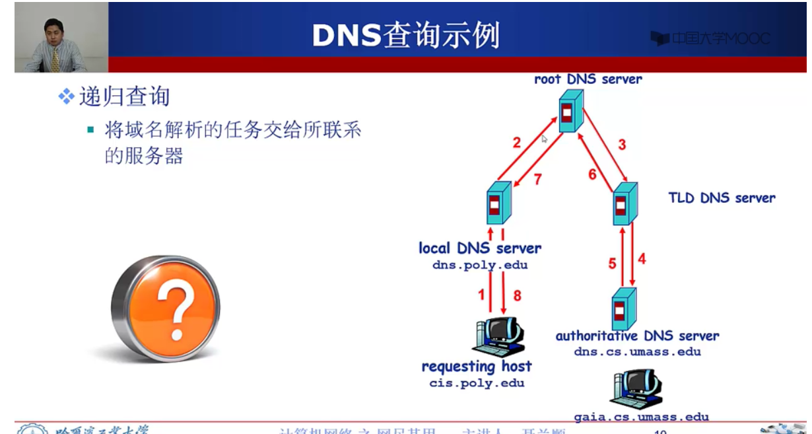
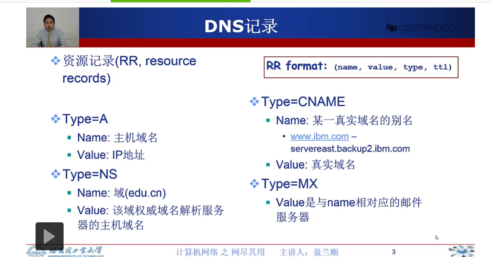

## 1. cookie技术

为什么: http协议无状态, 但是很多web服务是需要状态的, 比如网上购物

原理:

用于:

身份认证, 购物车, 推荐, web email, ...

问题:

隐私问题

一个网站的账户密码输入是可以被明文保存的?

## 2. web缓存/代理

## 3. Email应用

SMTP协议

学习使用 telnet模拟发一封邮件的过程

使用telnet模拟http访问

Email消息格式: 多媒体扩展

邮件访问协议(收): POP: Post Office Protocol

IMAP: Internet Mail Access Protocol

HTTP: 163, QQ Mail等 (浏览器端)

linux端的死亡之ping...

## 4. DNS应用

Domain Name System: 域名解析系统

<del>为什么域名的顺序是大的在后面, 小的在前面. 反过来不是更方便吗</del>

啊咧, 突然反应过来 西方人的习惯就是小的写在前面...

DNS迭代查询: 要经过这么多次查询, 延迟不会很长很长吗... (会的, 所以右DNS缓存)

DNS递归查询

### 问题: 我国没有根域名服务器, 是否会影响我国的网络安全 

一篇似乎很有道理的博客: http://blog.sina.com.cn/s/blog_b727ce740101atfw.html

答案是**会的**

### DNS数据库记录

CNAME是别名! 涨知识了

### DNS协议: 查询回复型协议

