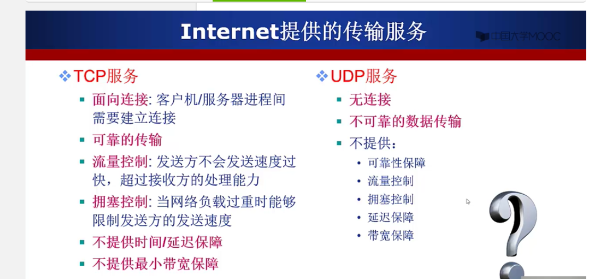
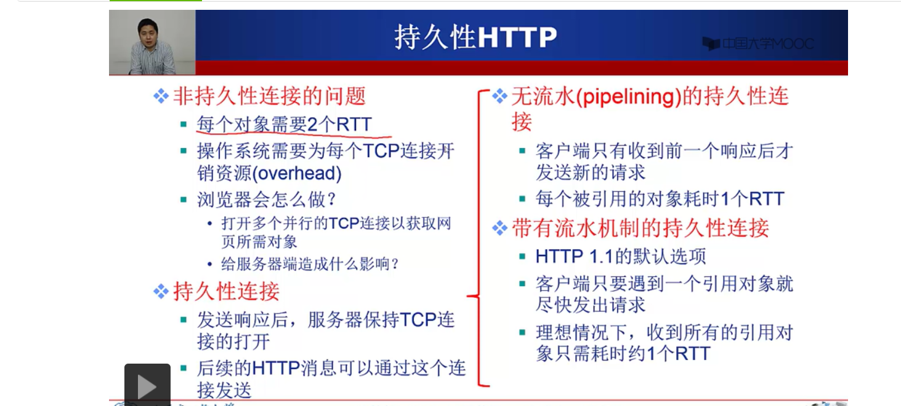

1. p2p结构的网络服务: 

    BT/电驴下载，非法传播视频的网站, 每个结点即是客户端又是服务端.

2. 进程通信

    套接字: socket

    寻址进程: ip地址 + 端口号

    端口号: http server: 80; mail server: 25

3. 遵循 应用层协议

    公开协议: 由RFC定义, 允许互操作: http, smtp

    私有协议: 许多p2p文件共享应用

4. 对传输服务的需求

    可靠性

    带宽

    时间延迟

    

    

5. 几个网络应用以及他们使用的传输协议

    | 名称 | 我猜 | 实际     |
    | :--- | :--- | -------- |
    | QQ   | TCP  | TCP, UDP |
    | 迅雷 | UDP  | UDP      |
    |      |      |          |
    |      |      |          |

    来自网上的引用

    > UDP协议是无连接方式的协议，它的效率高，速度快，占资源少，但是其传输机制为不可靠传送，必须依靠辅助的算法来完成传输控制。QQ采用的通信协议以UDP为主，辅以TCP协议。由于QQ的服务器设计容量是海量级的应用，一台服务器要同时容纳**十几万的并发连接**，因此服务器端只有采用UDP协议与客户端进行通讯才能保证这种超大规模的服务. 
    >
    > 
    >
    > QQ客户端之间的消息传送也采用了UDP模式，**这不同于国外的ICQ在客户端之间采用TCP进行通讯的模式**。因为国内的网络环境非常复杂，而且很多用户采用的方式是通过代理服务器共享一条线路上网的方式，在这些复杂的情况下，客户端之间能彼此建立起来TCP连接的概率较小，严重影响传送信息的效率。而UDP包能够穿透大部分的代理服务器，因此我们在开发QQ的时候选择了UDP作为客户之间的主要通信协议，因此网友会觉得用QQ传送信息要比ICQ及其它采用TCP协议的ICQ类软件快。
    >
    > ------------------------------------------------
    > 版权声明：本文为CSDN博主「魏波-」的原创文章，遵循 CC 4.0 BY-SA 版权协议，转载请附上原文出处链接及本声明。
    > 原文链接：https://blog.csdn.net/weibo1230123/article/details/79890865

    迅雷部分参考

    > http://ask.zol.com.cn/x/5322928.html
    >
    > https://www.zhihu.com/question/279256134

6. TCP和http的区别

    tcp: **T**ransmission **C**ontrol **P**rotocol

    传输控制协议, 它完成第四层传输层所指定的功能。在因特网协议族（Internet protocol suite）中，TCP层是位于[IP](https://zh.wikipedia.org/wiki/网际协议)层之上，[应用层](https://zh.wikipedia.org/wiki/应用层)之下的中间层。不同主机的应用层之间经常需要可靠的、像[管道](https://zh.wikipedia.org/wiki/管道_(Unix))一样的连接，但是IP层不提供这样的流机制，而是提供不可靠的包交换。

    http属于应用层, 看第9点OSI 七层模型, 依靠tcp

    > 参考 https://blog.csdn.net/bjyfb/article/details/6682913 , 介绍比较详细

7. Web应用

    http协议

    使用TCP传输服务

    无状态

    http1.1 的 持久性连接

    http1.0 是非持久性连接: 比如html中的图片链接, 每次都要发起http请求

    但是下面这个RTT怎么算的?

    

8. 一个问题: 既然web用的是tcp, 那么在它上面的所有服务都是tcp吗? 比如在爱奇艺的视频服务? 如果是, 那么他们可以改成UDP吗?

9. OSI 七层模型

    > （1）物理层
    >
    > 设备之间原始数据传输，数据格式比特流。
    >
    > （2）数据链路层
    >
    > 将原始比特流转换成逻辑传输数据，mac地址寻址，数据格式帧。
    >
    > （3）网络层
    >
    > 最复杂的一层，通信子网最高层。通过**路由算法**提供最佳传输路径。数据格式IP数据包。
    >
    > 数据链路层解决同一网络节点间数据传输，**网络层解决不同子网间通信**。
    >
    > （4）传输层
    >
    > 拆分数据包，提供端对端不同主机用户进程间传输数据，提供可靠或不可靠传输及流量控制，是连接通信子网和资源子网的桥梁。数据格式TCP数据包。
    >
    > （5）会话层
    >
    > 不同机器用户间建立或解除会话关系。
    >
    > （6）表示层
    >
    > 数据的表示方式（格式处理及编码转换）及特定功能实现（加解密、解压缩等）。
    >
    > （7）应用层
    >
    > 向用户提供服务，完成用户在网络上想完成的工作。如上网、发邮件、下载ftp等
    >
    > ------------------------------------------------
    > 版权声明：本文为CSDN博主「简洁是智慧的灵魂」的原创文章，遵循 CC 4.0 BY-SA 版权协议，转载请附上原文出处链接及本声明。
    > 原文链接：https://blog.csdn.net/wangpeifeng669/article/details/38510025

