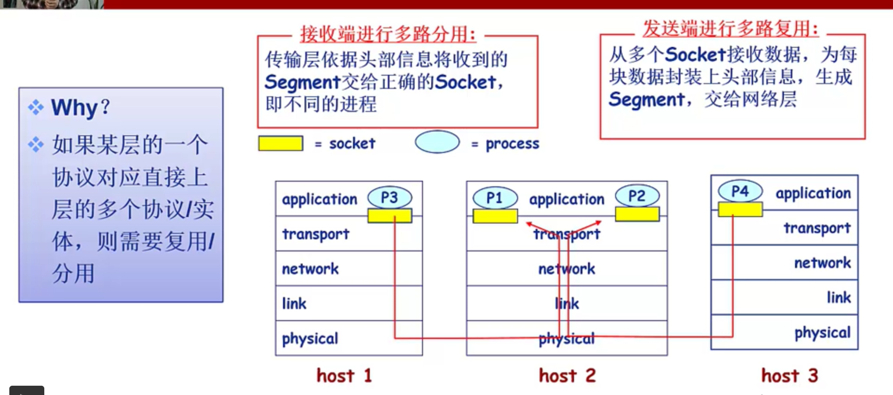

# 传输层

## 多路复用/分用

## UDP

user datagram protocol

### 基于IP协议:

1. 复用/分用
2. 简单的错误校验

best effort: 尽力而为

可能乱序, 可能丢失

### 无连接

无握手

延迟显著减少

实现简单, 不需要维护连接状态

没有拥塞控制(应用自由掌控)

### 常用于流媒体

1. 容忍丢失
2. 速率敏感

存在的问题可以在应用层解决(但较复杂)

头部32个bit, 8个Byte

### UDP校验和

