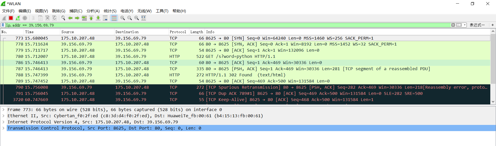

#  2019.9.12

中秋假期的学习任务/计划

## TODO

- [ ] 学习如何抓包以及其他常用网络分析工具
- [ ] 学习各种应用层协议, 通过抓包详细理解过程
- [ ] 开发一个/多个web程序, 做点有意思的事情
- [ ] 做几个书上的作业和实验

## 资料

几个极好的github库:

1. https://github.com/moranzcw/Computer-Networking-A-Top-Down-Approach-NOTES
2. https://github.com/HanochShi/Supplements-ComputerNetworking-ATopDownApproach-7th-ed
3. https://github.com/myk502/Top-Down-Approach

抓包工具wireshark: https://www.wireshark.org/#download

## Questions

1. 如何用wireshark抓指定网页/域名的包

    找到似乎不太靠谱的几个方法:

    dns.qry.name contains “Domain”  (似乎这个更加准确一点, 下面那个总是爬不到)

    http.host contains baidu.com

    看着挺专业, 但在我这里没用: https://www.cnblogs.com/davidwang456/p/10758090.html

    **下面自己摸索出的方法**

    首先我发现一个问题: 

    进行抓包时, 需要得到ip(不知道怎么用域名). 我们可以通过`nslookup baidu.com`得到百度的ip, 然而, 在浏览器里访问baidu, 访问的ip不是其中之一, 那么我怎么找? 我的解决方法是, 在浏览器里不直接输入baidu.com进行查找, 而是输入刚刚查找到的ip, 访问的结果就是baidu.com, 但用这种方法我们可以在wireshark中过滤这个ip.

    比如在我这里搜索到的百度的ip是39.156.69.79和220.181.38.148, 那么我就在浏览器访问`39.156.69.79/s?word=python`, 就在wireshark中过滤这个ip, 得到访问结果.

    

    还有另一种找ip的方式, 那就是在浏览器检查里找到的baidu的ip. 但是经过测试这样找到的ip的抓包抓到的包有很多很多, 比上面那种多多了, 基本都是tcp的包, 不知道为什么.

    

2. 如何使用wireshark抓指定app的包, 比如tim的包

    参考: https://blog.csdn.net/youxiansanren/article/details/48271851

    

3. 因特网协议栈和OSI参考模型的区别

    一知半解, 参考:

    https://blog.csdn.net/cat_foursi/article/details/71359156

### wireshark抓包入门

一个基本使用教程: https://www.cnblogs.com/52php/p/6262956.html