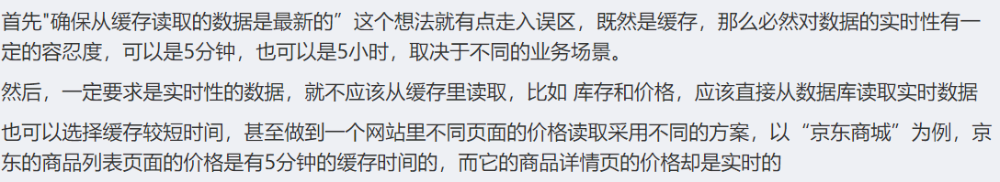
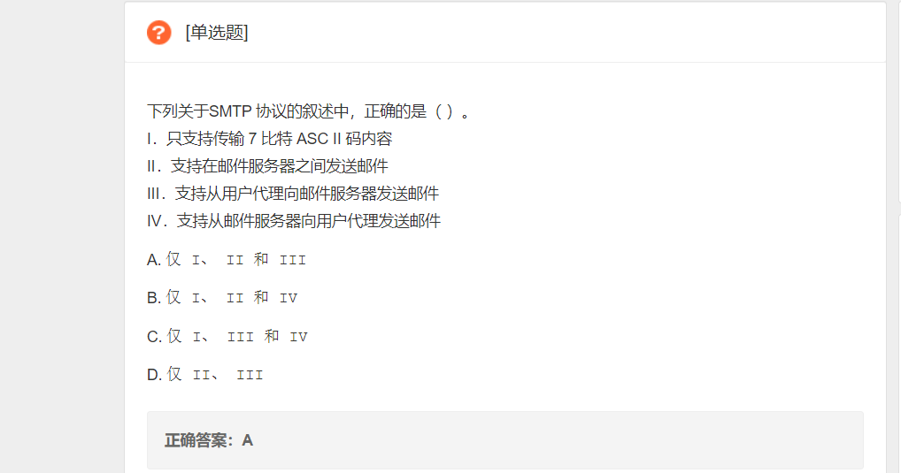

#  2019.9.12

中秋假期的学习任务/计划

## TODO

- [x] 学习如何抓包以及其他常用网络分析工具
- [x] 学习各种应用层协议, 通过抓包详细理解过程
- [x] 开发一个/多个web程序, 做点有意思的事情
- [x] 做几个书上的作业和实验

## 资料

几个极好的github库:

1. https://github.com/moranzcw/Computer-Networking-A-Top-Down-Approach-NOTES
2. https://github.com/HanochShi/Supplements-ComputerNetworking-ATopDownApproach-7th-ed
3. https://github.com/myk502/Top-Down-Approach

抓包工具wireshark: https://www.wireshark.org/#download

## Questions

1. 如何用wireshark抓指定网页/域名的包

    找到似乎不太靠谱的几个方法:

    dns.qry.name contains “Domain”  (似乎这个更加准确一点, 下面那个总是爬不到)

    http.host contains baidu.com

    看着挺专业, 但在我这里没用: https://www.cnblogs.com/davidwang456/p/10758090.html

    **下面自己摸索出的方法**

    首先我发现一个问题: 

    进行抓包时, 需要得到ip(不知道怎么用域名). 我们可以通过`nslookup baidu.com`得到百度的ip, 然而, 在浏览器里访问baidu, 访问的ip不是其中之一, 那么我怎么找? 我的解决方法是, 在浏览器里不直接输入baidu.com进行查找, 而是输入刚刚查找到的ip, 访问的结果就是baidu.com, 但用这种方法我们可以在wireshark中过滤这个ip.

    比如在我这里搜索到的百度的ip是39.156.69.79和220.181.38.148, 那么我就在浏览器访问`39.156.69.79/s?word=python`, 就在wireshark中过滤这个ip, 得到访问结果.

    

    还有另一种找ip的方式, 那就是在浏览器检查里找到的baidu的ip. 但是经过测试这样找到的ip的抓包抓到的包有很多很多, 比上面那种多多了, 基本都是tcp的包, 不知道为什么. 

    

2. 如何使用wireshark抓指定app的包, 比如tim的包

    参考: https://blog.csdn.net/youxiansanren/article/details/48271851

    

3. 因特网协议栈和OSI参考模型的区别

    一知半解, 参考:

    https://blog.csdn.net/cat_foursi/article/details/71359156

4. Web缓存器如何实时地获取到最新内容? 对于每次client的请求, 就算缓存器存储了以前的对象, 但是如果缓存器不向源服务器提交最新请求又怎么确定它一定是最新的呢? 源服务器又不会告诉web缓存器我已经修改了. 还是说允许最新的内容的获取有一定的延迟?

    参考: 

    1. https://zhuanlan.zhihu.com/p/59714349

    2. https://blog.csdn.net/sxj6977380/article/details/80929813

    

5. 浏览器中的网络应用, 都是用的http/https协议吗? 比如邮件服务, 它的SMTP开始的地方是从邮件服务器开始的, 而不是作为用户代理的本地服务器? tim, 微信这些应用的协议是什么? 邮箱使用的smtp协议是否可以用微信这种应用的协议取代? 电子邮件需要有特定的协议, 那么是不是其他的各种网络应用都需要有一种特殊的协议呢?

    > 一般(我猜)的web应用都有特定的应用层协议, 比如qq, 微信, iqiyi, 他们的服务功能不同, 所需要的协议类型也不同. 特别大型的应用我觉得应该会设计适合自己的应用层协议吧?

    下面这题解答我的一个疑惑: 从用户代理向邮件服务器发送邮件也是可以用smtp. 

    

    

6. 但是, 如果是在浏览器上访问邮件呢? 浏览器那里不是用的http/https吗? 所以同一个web程序, 在客户端和在浏览器上访问的机制有很大的不同? 而也是很多视频网站说客户端访问提升多少多少速度的原因? 在浏览器上的web程序可以使用其他协议吗?

    参见一个微信url: `weixin://` , 之所以我们能够访问一个web网站, 是因为它有web服务器比如apache一类, 微信的服务器显然不是apache这种, 是他特有的web服务器. 其实看本质, apache为什么能用呢? 因为它支持http协议, 是专门这样写的, 那么其他web服务比如邮件, 有一套自己的协议, 所以不需要http.

    比如视频客户端, 如果不支持从浏览器访问, 它有一套他自己的协议, 那么用自己的协议做客户端就好了

    对于浏览器上发送邮件, 我的理解大概是, 浏览器使用http协议与发送方服务器进行通信, 这个过程里面, 浏览器的作用是交互, 使用的是http协议, http的功能完全可以把用户需要发送的信息以及文件提交到发送方服务器, 然后发送方服务器使用smtp协议将邮件发送到接收方服务器. 它的整个流程大概是这样的: 1.发送方用户代理(浏览器) -> 2.发送方邮件服务器 -> 3.收件方邮件服务器 -> 4.收件方用户代理(浏览器/客户端). 从2 - >3的话, 是一定要用smtp发送的, 然后1 -> 2过程的话, 用浏览器完全可以使用http协议, 因为这份邮件在发送出去之前, 并不需要在用户电脑上就组织好, 在发送方服务器上组织好就可以了. 浏览器(或者说用户), 只需要把邮件需要的材料提交给发送方服务器, 所以并不一定需要smtp协议. 当然也是可以直接用smtp协议发送组织好的邮件的. (如果有这种机制的话)

    

---

## 感想与体会

1. 学习pop3协议时, 感觉到邮件的设计思想很古老. 对于不是从那个时期走过来的我来说, 觉得很奇怪. 比如pop3不支持让邮件在远程服务器上保留并保存在文件夹中, 太落后了. 是不是这些协议就是相当于一种"语言", 它不支持一些功能, 所以就应该换另一种"语言"(协议)? 因为从我的想法来看, 创建文件夹, 邮件内容, 这不就是几个命令的问题吗? 
2. 再者, 邮件服务似乎是很独特的服务. 但在我看来, 有这么复杂吗? 用http不也完全可以做到吗? 比如所谓的push邮件, 不久相当于访问服务器, 然后传一些信息给他吗? 然后pull收邮件, 不也是访问服务器, 只不过我们这次下载一些东西吗? 为什么把他们搞得区别这么大? 单纯用http应该也可以做出现在的邮件服务吧?
3. 一个教训: 问问题要等看完相关书本内容和网上找资料后再问. 昨天问学长们的问题, 今天在书上看到了, 这就傻逼了, 为什么不看完书经过思考后再问? 一知半解就去问, 这不是很不负责吗.

| 应用  | 应用层协议   | 端口号 | 传输层协议 |
| ----- | ------------ | ------ | ---------- |
| Web   | http / https | 80     | tcp        |
| email | smtp         | 25     | tcp        |
|       | pop3         | 110    | tcp        |
| DNS   | DNS          | 53     | UDP        |
|       |              |        |            |

 